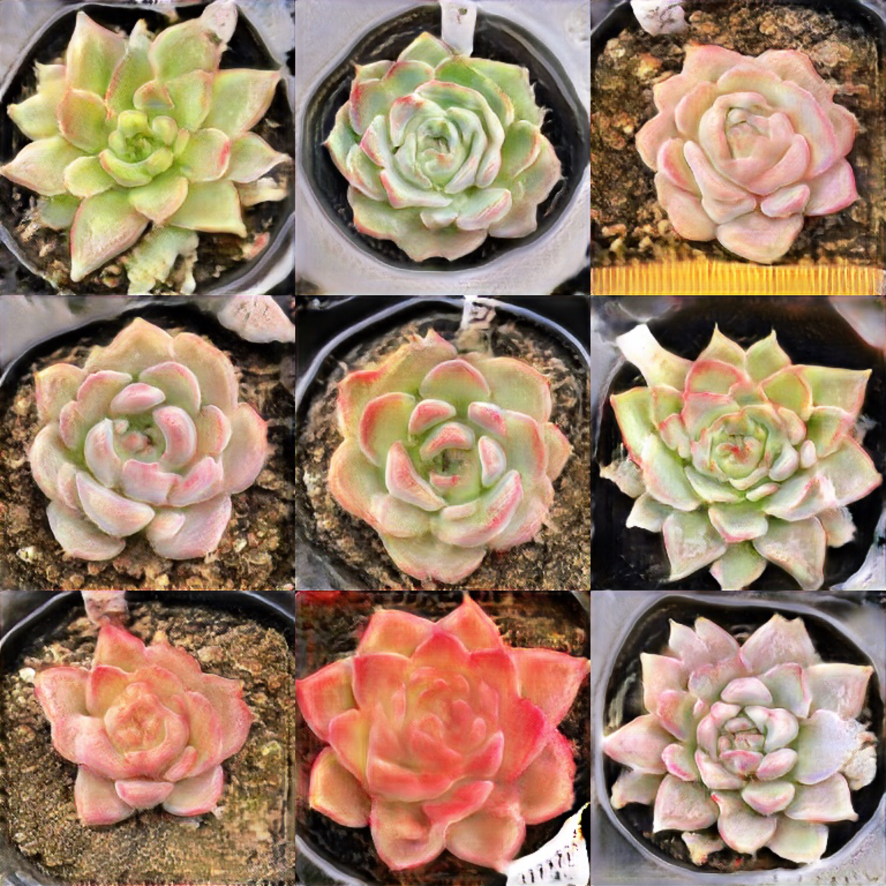

# Succulent-Generator
Generating fake succulent images using ProGAN.

[Generative adversarial network](https://en.wikipedia.org/wiki/Generative_adversarial_network)

## Usage
The pre-trained models are `generator.pth` and `critic.pth` in the [google drive](https://drive.google.com/drive/folders/1qxup4DrslHZfO0LAHTRfEU3fyHNPG8v5?usp=sharing), to generating fake images simply run 

> python3 train.py
  
It will generate 100 fake succulents images with size 512x512 inside the `saved_examples` folder.

If you wish to train your own model using your own dataset, you will need to have cuda downloaded in your machine and pytorch setup etc. Then in the [config.py](https://github.com/Ifan24/Succulent-Generator/blob/main/config.py), change the *dataset* to the path of your dataset and adjusting the hyperparameters based on your VRAM. If you wise to load or not load existing model, set *LOAD_MODEL* to True or False.

## Generated Images
fake images

***

real images

check the [google drive](https://drive.google.com/drive/folders/1qxup4DrslHZfO0LAHTRfEU3fyHNPG8v5?usp=sharing) for more examples
## Improvements
1. The quality of the images can definitely be improved by training more epochs, it takes about 12 hrs to train on my laptop (Nvidia 1070 MAX Q), one epoch for training the model on 512x512 images takes about ~hr. 
2. The dataset I gether has about 9000 images, I believed if more images are added the quality can also be improved, and some of the images are not very suitable to be included in the dataset as the size of original images are more than 2000x2000 and center crop it to 512x512 makes it looks less like a succulent. Additionally, the shape of different succulents vary a lot, I think it might result in generating more strange images, it might be better to have all the images to have some common features.

## Credit
Implementing the ProGAN based on this video

The codes for model and the training are the same as in the video, I made some small modifications to the config and instead of generating 1024x1024 images it will only train the model to generate 512x512 images as it takes quite a long time to train.

The succulents images I used in this project are mostly downloaded from shopping website, since most open source datasets I found for succulent are either has blurring images or just too small for this project.

The raw images are ranges from 800x800 to 2400x2400, torchvision is used to center crop the image to 512x512.
Then I manually deleted some images from the dataset that are either too close to the camera or lose some features of succulent due to cropping.
